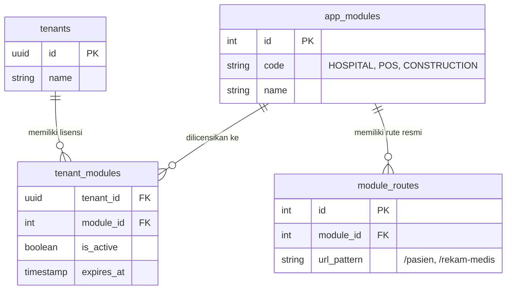

# Document Rencana Arsitektur & Development Roadmap: Multi-Tenant Multi-App Platform

## 1. Ringkasan Eksekutif
Dokumen ini mencatat konsep arsitektur, skema basis data dinamis, dan peta jalan pengembangan (development roadmap) untuk memutar fondasi aplikasi yang ada (Storage Dokumen, Foto/Galeri, WhatsApp, User, Tenant, Role Permission) menjadi platform **SaaS Multi-Tenant Multi-App** (Rumah Sakit, POS/Penjualan, Konstruksi, dll).

---

## 2. Struktur Modul & Reusability (Modular Monolith)

### Core Shared Services (Sudah Ada & Matang)
Seluruh modul bisnis di masa depan wajib memanfaatkan **Core Services** berikut melalui *Dependency Injection* tanpa membuat ulang dari nol:
- `documents`: Storage Dokumen & KTP/Faktur/Kontrak
- `gallery`: Storage Foto & Album Produk/Pasien/Proyek
- `whatsapp`: Engine Notifikasi WhatsApp
- `company-profile`: Identitas & Branding Perusahaan per Tenant
- `users`, `role`, `tenants`, `permissions`, `menu`: Manajemen Akses & Multi-Tenancy

### Struktur Folder Backend (NestJS)
```text
src/
├── core/                        <-- SHARED CORE SERVICES
│   ├── documents/
│   ├── gallery/
│   ├── whatsapp/
│   ├── company-profile/
│   └── tenants/ & users/ & role/ & menu/
│
├── modules-rs/                  <-- DOMAIN RUMAH SAKIT
│   ├── pasien/
│   ├── rekam-medis/
│   ├── pendaftaran/
│   └── farmasi/
│
├── modules-pos/                 <-- DOMAIN PENJUALAN / POS
│   ├── barang/
│   ├── kasir/
│   ├── penjualan/
│   └── stok/
│
└── modules-konstruksi/          <-- DOMAIN KONSTRUKSI
    ├── proyek/
    ├── rab/
    └── material/
```

---

## 3. Dynamic Feature Licensing & Menu Restriction (100% Database-Driven)

Untuk mencegah kebocoran modul antar jenis aplikasi (misal Tenant Rumah Sakit menambahkan URL Kasir Penjualan):

### A. Skema Tabel Database


### B. Validasi Rute Dinamis di Backend (`MenuService`)
1. Backend melakukan query `JOIN` real-time dari `tenant_modules` -> `module_routes` berdasarkan `tenantId` pengguna.
2. Setiap kali ada request `POST /menus` atau `PUT /menus/:id`, backend memverifikasi apakah `url` yang diinput ada di dalam daftar `module_routes` yang dilisensikan.
3. Hasil query rute di-cache di Redis (`tenant:allowed_routes:{tenantId}`) untuk kecepatan eksekusi di bawah 5ms.

### C. UI Dropdown Restriction di Frontend (Nuxt 3)
1. Form Manajemen Menu (`pages/[slug]/menu/index.vue`) mengambil daftar rute resmi via `GET /menus/allowed-routes`.
2. Input teks bebas `URL Route` digantikan dengan `<select>` dropdown dinamis dari hasil API tersebut.

---

## 4. Peta Jalan Pengembangan (Development Roadmap)

- [x] **Fase 1: Core Platform Base (SELESAI)**
  - System Auth, Multi-Tenant Engine, Role & Permission ABAC/RBAC, Storage Dokumen, Storage Foto/Galeri, Engine WhatsApp, Manajemen Menu & Dynamic Tree Visibility.
- [ ] **Fase 2: Dynamic Module Licensing System**
  - Implementasi tabel `app_modules`, `module_routes`, `tenant_modules`.
  - Implementasi endpoint `GET /menus/allowed-routes` & validasi `validateMenuUrlForTenant`.
  - Integrasi dropdown catalog rute di Nuxt 3 frontend.
- [ ] **Fase 3: Expansion Domain Modules**
  - Pengembangan `modules-rs` (Rumah Sakit).
  - Pengembangan `modules-pos` (Penjualan / POS).
  - Pengembangan `modules-konstruksi` (Konstruksi / Proyek).
